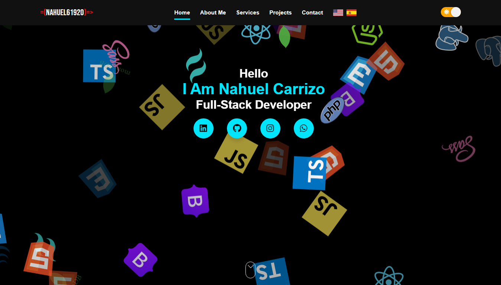

# 🚀 Shravankumar Patel | Portfolio

A modern, animated, and fully responsive portfolio website to showcase my projects, skills, certificates, and education.

## 🌐 Live Demo
[View Portfolio Live](https://shravanbpatel954.github.io/my-portfolio-webdeveloper/)

---

## ✨ Features
- Animated hero section with typing effect
- Swiper carousel for projects with modal popups
- Glassmorphism and glowing effects for certificates and education
- Responsive design for all devices
- Dark/light mode toggle
- Contact section with animated contact methods

---

## 🛠️ Tech Stack
- **React.js**
- **Swiper.js** (carousel)
- **CSS3** (glassmorphism, animations)
- **react-typical** (typing animation)
- **GitHub Pages** (deployment)

---

## 📦 How to Run Locally
1. Clone the repo:
   ```bash
   git clone https://github.com/shravanbpatel954/my-portfolio-webdeveloper.git
   cd my-portfolio-webdeveloper
   ```
2. Install dependencies:
   ```bash
   npm install
   ```
3. Start the development server:
   ```bash
   npm start
   ```
4. Open [http://localhost:3000](http://localhost:3000) to view it in your browser.

---

## 📸 Screenshots


---

## 📬 Contact
- **LinkedIn:** [shravan-kumar-patel](https://www.linkedin.com/in/shravan-kumar-patel/)
- **Email:** shravanbpatel954@gmail.com
- **GitHub:** [shravanbpatel954](https://github.com/shravanbpatel954)

---

> Made with ❤️ by Shravankumar Patel
